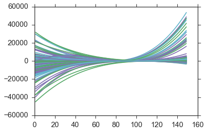
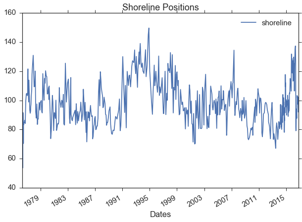
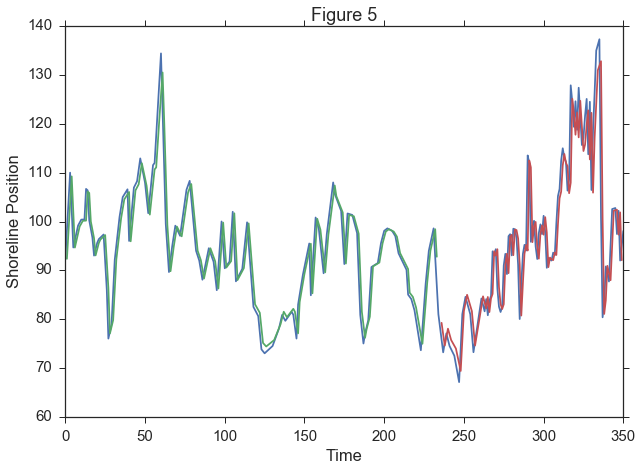

# Forecasting Narrabeen Shoreline Positions

The goal of this notebook is provide insight of what goes into forecasting the shoreline position of the Narrabeen Collary Beach. We will be examining Profile 1, but note that this method is applicable to any of the different profiles.

We first import the modules that we need


```python
# It seems like a lot of modules, but this notebook accomplishes many different objectives.

import sys
if sys.version_info[0] < 3: 
    from StringIO import StringIO
else:
    from io import StringIO
import numpy
import matplotlib.pyplot as plt
import seaborn as sns
import pandas as pd
import numpy as np
import math
from scipy import interpolate
from keras.models import Sequential
from keras.layers import Dense
from keras.layers import LSTM
from sklearn.preprocessing import MinMaxScaler
from sklearn.metrics import mean_squared_error
sns.set_context('notebook',font_scale=1.5)
sns.set_style('ticks')
%matplotlib inline
```

    Using Theano backend.


Now, let's import the raw dataset that will be used


```python
profile = pd.read_csv('Narrabeen_Profiles_new.csv')
```


```python
# here is what the dataset looks like

profile.head()
```


<div>
<table border="1" class="dataframe">
  <thead>
    <tr style="text-align: right;">
      <th></th>
      <th>Site</th>
      <th>Profile ID</th>
      <th>Date</th>
      <th>Chainage</th>
      <th>Elevation</th>
      <th>Flag</th>
    </tr>
  </thead>
  <tbody>
    <tr>
      <th>0</th>
      <td>NARRA</td>
      <td>PF1</td>
      <td>1976-04-27</td>
      <td>0</td>
      <td>9.09</td>
      <td>EMERY</td>
    </tr>
    <tr>
      <th>1</th>
      <td>NARRA</td>
      <td>PF1</td>
      <td>1976-04-27</td>
      <td>10</td>
      <td>8.79</td>
      <td>EMERY</td>
    </tr>
    <tr>
      <th>2</th>
      <td>NARRA</td>
      <td>PF1</td>
      <td>1976-04-27</td>
      <td>20</td>
      <td>8.06</td>
      <td>EMERY</td>
    </tr>
    <tr>
      <th>3</th>
      <td>NARRA</td>
      <td>PF1</td>
      <td>1976-04-27</td>
      <td>30</td>
      <td>6.65</td>
      <td>EMERY</td>
    </tr>
    <tr>
      <th>4</th>
      <td>NARRA</td>
      <td>PF1</td>
      <td>1976-04-27</td>
      <td>40</td>
      <td>4.86</td>
      <td>EMERY</td>
    </tr>
  </tbody>
</table>
</div>


We can now begin to see the issues with this dataset. It appears that the shoreline position was never strictly collected and that the dataset has the Profile IDs in random order.

The format of this notebook is going to be split in to 3 sections.
* 1.) Obtaining shoreline positions
* 2.) Interpolating dates
* 3.) Training Neural Network

# 1.) Obtaining Shoreline Positions

To fix this issue we need to write some code to only get the information for profile 1, from there we can get the shoreline position.


```python
# convert the dataframe above to an array

array = profile.values.astype(str)
```


```python
# create 3 empty lists
chain = []
elevation = []
date = []

# in each line of the above dataframe, if the profile is not PF1, it is ignored
for line in array:
    if not line[1].startswith('PF1'): continue
        
    # if it is PF1, append all the information to the 3 empty lists
    chain.append(float(line[3]))
    elevation.append(float(line[4]))
    date.append(line[2])

# once the lists are complete we convert them to a dataframe to work with
chain_df = pd.DataFrame(chain)
elev_df = pd.DataFrame(elevation)
# in this last line, we introduced pd.to_datetime(), this converts from a string to datetime objects
date_df = pd.DataFrame(pd.to_datetime(date))

# each time a dataframe is created from a list, we must rename the column to be able to join them together
chain_df.rename(columns={0:'chainage'},inplace=True)
elev_df.rename(columns={0:'elevation'},inplace=True)
date_df.rename(columns={0:'Date'},inplace=True)

# join the dataframes together
main = chain_df.join(elev_df)
main = main.join(date_df)
```


```python
# Here is the new dataframe with the information that we need

main.head()
```


<div>
<table border="1" class="dataframe">
  <thead>
    <tr style="text-align: right;">
      <th></th>
      <th>chainage</th>
      <th>elevation</th>
      <th>Date</th>
    </tr>
  </thead>
  <tbody>
    <tr>
      <th>0</th>
      <td>0.0</td>
      <td>9.09</td>
      <td>1976-04-27</td>
    </tr>
    <tr>
      <th>1</th>
      <td>10.0</td>
      <td>8.79</td>
      <td>1976-04-27</td>
    </tr>
    <tr>
      <th>2</th>
      <td>20.0</td>
      <td>8.06</td>
      <td>1976-04-27</td>
    </tr>
    <tr>
      <th>3</th>
      <td>30.0</td>
      <td>6.65</td>
      <td>1976-04-27</td>
    </tr>
    <tr>
      <th>4</th>
      <td>40.0</td>
      <td>4.86</td>
      <td>1976-04-27</td>
    </tr>
  </tbody>
</table>
</div>


```python
# convert the above dataframe to an array
array = main.values.astype(str)

# initialize an empty dataframe
new_x = pd.DataFrame()

# empty list
dates = []

#initialize variables to 0
count = 0
value = 0

# loop through each string in the array
for i in array[:]:
    count += 1    
    if i[1].startswith('-') and value >= 0:
        df_y = elev_df[count-3: count+1]
        df_x = chain_df[count-3:count+1]
        df_x = df_x.sort_values("chainage")
        
        x_array = df_x.values.astype(float)
        y_array = df_y.values.astype(float)
        
        x_array = x_array.reshape(-1,)
        y_array = y_array.reshape(-1,)
        
        x = x_array.tolist()
        y = y_array.tolist()
                
        f = interpolate.UnivariateSpline(x_array, y_array, s=0)
        x_new = np.arange(1,150,1)
        
        plt.plot(x,y,'x',x_new,f(x_new))   
        
        # y value to find is 0, that is the shoreline position
        yToFind = 0        
        yreduced = np.array(y) - yToFind        
        f_reduced = interpolate.UnivariateSpline(x, yreduced, s=0)
        df = pd.DataFrame(f_reduced.roots())       
        dates.append(i[2])
                
        if new_x.empty:
            new_x = df                
        else:
            new_x = new_x.append(df)
    value = float(i[1])
            
new_x.rename(columns = {0:"Chainage"}, inplace=True)
new_x = new_x.reset_index()
date_df = pd.DataFrame(pd.to_datetime(dates))
date_df.rename(columns={0:'Dates'}, inplace=True)
```





```python
# setting up the data to plot

x = new_x.values
shoreline = []
for i in x:
    if not i[0] == 0: continue
    shoreline.append(i[1])
shoreline_df = pd.DataFrame(shoreline)
shoreline_df.rename(columns={0:'shoreline'},inplace=True)

shoreline_df = shoreline_df.join(date_df)
shoreline_df = shoreline_df[shoreline_df.shoreline != 0.07803480405574043]
plots = shoreline_df.set_index('Dates')
```


```python
plt.figure()
plots.plot(figsize=(10,7))
plt.title('Shoreline Positions')
```


    <matplotlib.text.Text at 0x12095ce50>


    <matplotlib.figure.Figure at 0x11a6252d0>





# 2.) Interpolating Dates

Now that we have the shoreline positions corresponding with the dates, we need to see how many days are inbetween each entry.


```python
shoreline_df.tail()
```


<div>
<table border="1" class="dataframe">
  <thead>
    <tr style="text-align: right;">
      <th></th>
      <th>shoreline</th>
      <th>Dates</th>
    </tr>
  </thead>
  <tbody>
    <tr>
      <th>589</th>
      <td>102.762841</td>
      <td>2016-09-12</td>
    </tr>
    <tr>
      <th>590</th>
      <td>97.428254</td>
      <td>2016-09-26</td>
    </tr>
    <tr>
      <th>591</th>
      <td>102.184696</td>
      <td>2016-10-14</td>
    </tr>
    <tr>
      <th>592</th>
      <td>92.002161</td>
      <td>2016-10-25</td>
    </tr>
    <tr>
      <th>593</th>
      <td>98.053263</td>
      <td>2016-11-11</td>
    </tr>
  </tbody>
</table>
</div>


We can see even from this small section that the days inbetween entries are not evenly spaced, which when working with a neural netowrk is preferred if one wants to obtain the lag values.


```python
dt = shoreline_df.set_index('Dates')
```

In this dataset, the majority of the data was collected from 2005-present so I am going to ignore the time period before then. This is to avoid issues with interpolating too many data points.


```python
dt = dt[320:]
```


```python
def optimize(df, resample_method):
    greatest_so_far = 0
    integer = 0
    for i in range(1,resample_method+1):
        resample = df.resample(str(i)+'D').mean()
        length = len(resample)
        actual = len(resample.dropna())
        percent = float(actual)/float(length)
        
        if percent > greatest_so_far:
            greatest_so_far = percent
            integer = i
    greatest = greatest_so_far*100.0
    interp_percent = 100.0-greatest
    print 'Precent of actual values:         '+str(greatest)
    print 'Percent of interpolated values:   '+str(interp_percent)
    print 'Number of days to resample by:    '+str(integer)
    print 'Number of data entries:           '+str(len(resample))
```

The above function accepts the dataframe and determines the how many data points are real and interpolated by changing the resample parameter. 


```python
optimize(dt, 12)
```

    Precent of actual values:         54.1310541311
    Percent of interpolated values:   45.8689458689
    Number of days to resample by:    12
    Number of data entries:           351


```python
resample = dt.resample('12D').mean()
```


```python
shoreline  = resample.interpolate()
```


```python
shoreline.head()
```


<div>
<table border="1" class="dataframe">
  <thead>
    <tr style="text-align: right;">
      <th></th>
      <th>shoreline</th>
    </tr>
    <tr>
      <th>Dates</th>
      <th></th>
    </tr>
  </thead>
  <tbody>
    <tr>
      <th>2005-05-13</th>
      <td>92.283459</td>
    </tr>
    <tr>
      <th>2005-05-25</th>
      <td>98.188972</td>
    </tr>
    <tr>
      <th>2005-06-06</th>
      <td>104.094486</td>
    </tr>
    <tr>
      <th>2005-06-18</th>
      <td>110.000000</td>
    </tr>
    <tr>
      <th>2005-06-30</th>
      <td>102.337268</td>
    </tr>
  </tbody>
</table>
</div>


# 3.) LSTM Recurrent Neural Network

We are now ready to use this data in a neural network. Let's begin by using a new function.


```python
def create_dataset(dataset, look_back=1):
    dataX, dataY = [], []
    for i in range(len(dataset)-look_back-1):
        a = dataset[i:(i+1), 0]
        dataX.append(a)            
        dataY.append(dataset[i + look_back, 0])
    return numpy.array(dataX), numpy.array(dataY)
# fix random seed for reproducibility
numpy.random.seed(7)
```


```python
# convert the shoreline positions to an array and then normalize them to values between 0 and 1
# the neural network is extremely sensitive to large values, so by doing this we reduce any errors
dataset = shoreline.values.astype('float32')
scaler = MinMaxScaler(feature_range=(0,1))
dataset = scaler.fit_transform(dataset)
```


```python
# split the dataset into 66% training, and 33% to test the data on
train_size = int(len(dataset)*0.67)
test_size = len(dataset) - train_size
train, test = dataset[0:train_size,:], dataset[train_size:len(dataset),:]
```


```python
# look back is how many days back to train the data off of.
# if look_back is 1, X = t, Y = t+1
# if look_back is 2, X = t, Y = t+2
look_back = 1
trainX, trainY = create_dataset(train, look_back)
testX, testY = create_dataset(test, look_back)
```


```python
# Reshaping the arrays to be of the form (size, time_steps, features)

trainX = numpy.reshape(trainX, (trainX.shape[0], 1, trainX.shape[1]))
testX = numpy.reshape(testX, (testX.shape[0], 1, testX.shape[1]))
```


```python
# Building the LSTM RNN model

model = Sequential()
model.add(LSTM(4, input_dim=1))
model.add(Dense(1))
model.compile(loss='mean_squared_error', optimizer='adam')
model.fit(trainX, trainY, nb_epoch=100, batch_size=1, verbose=2)
```

    Epoch 1/100
    0s - loss: 0.0701
    Epoch 2/100
    0s - loss: 0.0148
    Epoch 3/100
    0s - loss: 0.0126
    Epoch 4/100
    0s - loss: 0.0107
    Epoch 5/100
    0s - loss: 0.0086
    Epoch 6/100
    0s - loss: 0.0064
    Epoch 7/100
    0s - loss: 0.0046
    Epoch 8/100
    0s - loss: 0.0035
    Epoch 9/100
    0s - loss: 0.0029
    Epoch 10/100
    0s - loss: 0.0027
    Epoch 11/100
    0s - loss: 0.0027
    Epoch 12/100
    0s - loss: 0.0027
    Epoch 13/100
    0s - loss: 0.0026
    Epoch 14/100
    0s - loss: 0.0026
    Epoch 15/100
    0s - loss: 0.0026
    Epoch 16/100
    0s - loss: 0.0027
    Epoch 17/100
    0s - loss: 0.0026
    Epoch 18/100
    0s - loss: 0.0026
    Epoch 19/100
    0s - loss: 0.0026
    Epoch 20/100
    0s - loss: 0.0026
    Epoch 21/100
    0s - loss: 0.0026
    Epoch 22/100
    0s - loss: 0.0025
    Epoch 23/100
    0s - loss: 0.0026
    Epoch 24/100
    0s - loss: 0.0026
    Epoch 25/100
    0s - loss: 0.0026
    Epoch 26/100
    0s - loss: 0.0026
    Epoch 27/100
    0s - loss: 0.0026
    Epoch 28/100
    0s - loss: 0.0027
    Epoch 29/100
    0s - loss: 0.0026
    Epoch 30/100
    0s - loss: 0.0026
    Epoch 31/100
    0s - loss: 0.0026
    Epoch 32/100
    0s - loss: 0.0026
    Epoch 33/100
    0s - loss: 0.0026
    Epoch 34/100
    0s - loss: 0.0026
    Epoch 35/100
    0s - loss: 0.0026
    Epoch 36/100
    0s - loss: 0.0026
    Epoch 37/100
    0s - loss: 0.0026
    Epoch 38/100
    0s - loss: 0.0027
    Epoch 39/100
    0s - loss: 0.0026
    Epoch 40/100
    0s - loss: 0.0026
    Epoch 41/100
    0s - loss: 0.0026
    Epoch 42/100
    0s - loss: 0.0026
    Epoch 43/100
    0s - loss: 0.0026
    Epoch 44/100
    0s - loss: 0.0026
    Epoch 45/100
    0s - loss: 0.0026
    Epoch 46/100
    0s - loss: 0.0026
    Epoch 47/100
    0s - loss: 0.0026
    Epoch 48/100
    0s - loss: 0.0026
    Epoch 49/100
    0s - loss: 0.0026
    Epoch 50/100
    0s - loss: 0.0026
    Epoch 51/100
    0s - loss: 0.0026
    Epoch 52/100
    0s - loss: 0.0026
    Epoch 53/100
    0s - loss: 0.0026
    Epoch 54/100
    0s - loss: 0.0025
    Epoch 55/100
    0s - loss: 0.0026
    Epoch 56/100
    0s - loss: 0.0025
    Epoch 57/100
    0s - loss: 0.0026
    Epoch 58/100
    0s - loss: 0.0025
    Epoch 59/100
    0s - loss: 0.0026
    Epoch 60/100
    0s - loss: 0.0026
    Epoch 61/100
    0s - loss: 0.0025
    Epoch 62/100
    0s - loss: 0.0026
    Epoch 63/100
    0s - loss: 0.0026
    Epoch 64/100
    0s - loss: 0.0026
    Epoch 65/100
    0s - loss: 0.0026
    Epoch 66/100
    0s - loss: 0.0026
    Epoch 67/100
    0s - loss: 0.0026
    Epoch 68/100
    0s - loss: 0.0025
    Epoch 69/100
    0s - loss: 0.0025
    Epoch 70/100
    0s - loss: 0.0026
    Epoch 71/100
    0s - loss: 0.0025
    Epoch 72/100
    0s - loss: 0.0026
    Epoch 73/100
    0s - loss: 0.0026
    Epoch 74/100
    0s - loss: 0.0026
    Epoch 75/100
    0s - loss: 0.0026
    Epoch 76/100
    0s - loss: 0.0026
    Epoch 77/100
    0s - loss: 0.0026
    Epoch 78/100
    0s - loss: 0.0026
    Epoch 79/100
    0s - loss: 0.0026
    Epoch 80/100
    0s - loss: 0.0026
    Epoch 81/100
    0s - loss: 0.0026
    Epoch 82/100
    0s - loss: 0.0026
    Epoch 83/100
    0s - loss: 0.0025
    Epoch 84/100
    0s - loss: 0.0026
    Epoch 85/100
    0s - loss: 0.0026
    Epoch 86/100
    0s - loss: 0.0026
    Epoch 87/100
    0s - loss: 0.0025
    Epoch 88/100
    0s - loss: 0.0026
    Epoch 89/100
    0s - loss: 0.0026
    Epoch 90/100
    0s - loss: 0.0026
    Epoch 91/100
    0s - loss: 0.0026
    Epoch 92/100
    0s - loss: 0.0026
    Epoch 93/100
    0s - loss: 0.0026
    Epoch 94/100
    0s - loss: 0.0026
    Epoch 95/100
    0s - loss: 0.0025
    Epoch 96/100
    0s - loss: 0.0026
    Epoch 97/100
    0s - loss: 0.0025
    Epoch 98/100
    0s - loss: 0.0026
    Epoch 99/100
    0s - loss: 0.0026
    Epoch 100/100
    0s - loss: 0.0026


    <keras.callbacks.History at 0x127498d90>


```python
# making predictions on the training and test sets
trainPredict = model.predict(trainX)
testPredict = model.predict(testX)
```


```python
# here we have to convert the normalized values back to the original scale

trainPredict = scaler.inverse_transform(trainPredict)
trainY = scaler.inverse_transform([trainY])
testPredict = scaler.inverse_transform(testPredict)
testY = scaler.inverse_transform([testY])
```


```python
# print the mean squared error for the train and test predictions

trainScore = math.sqrt(mean_squared_error(trainY[0], trainPredict[:,0]))
print('Train Score: %.2f RMSE' % (trainScore))
testScore = math.sqrt(mean_squared_error(testY[0], testPredict[:,0]))
print('Test Score: %.2f RMSE' % (testScore))
```

    Train Score: 3.49 RMSE
    Test Score: 6.68 RMSE


```python
# shifting the train and test datasets to be able to plot
trainPredictPlot = numpy.empty_like(dataset)
trainPredictPlot[:, :] = numpy.nan
trainPredictPlot[look_back:len(trainPredict)+look_back, :] = trainPredict

testPredictPlot = numpy.empty_like(dataset)
testPredictPlot[:, :] = numpy.nan
testPredictPlot[len(trainPredict)+(look_back*2)+1:len(dataset)-1, :] = testPredict


# plot figure
plt.figure(figsize=(10,7))
plt.plot(scaler.inverse_transform(dataset))
plt.title('Figure 5')
plt.xlabel('Time')
plt.ylabel('Shoreline Position')
plt.plot(trainPredictPlot)
plt.plot(testPredictPlot)
plt.show()
```





We can see that when the look_back is 1, the forecast is extremely accurate. When the value of the look_back is increased the accuracy of the prediction will decrease due to less linearity in the training and target values. 
